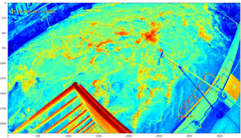

# AWIVE Configurator
The AWIVE configurator is a software used to analyze images in order to
determine the configuration used for the [awive](https://github.com/JosephPenaQuino/adaptive-water-image-velocimetry-estimator)
project.


## Getting Started

### Prerequisites

This software was tested in:

- Linux host computer (ubuntu 22.04)
- Python 3.11.2

### Installation

If you are using uv, execute the commands below:

```bash
uv sync
source .venv/bin/activate
```

Otherwise, excute these commands:

```bash
python -m venv venv
source venv/bin/activate
python -m pip install .
```

## Usage

The awive configurator have the following features:

- image analyzer
- AWIVE runner

Before attempting to use any feature, crete your own configuration file:

```
cp config.example.json config.json
```

### Image Analyzer


In order run the image analyzer, you require the following:

- The path of the video to be analyzed
- The path where to save frames extracted from the video

Firstly, set both previous paths in the `config.json` in the keys
`dataset.video_path` and `dataset.image_dataset` respectively.

Then, execute the command below to just visualize a frame from the video:

```bash
python -m awivec.analyze_image config.json -P
```

It should display some image like the one shown below:

<center>
    
</center>


Probably the displayed image is not suitable for any of AWIVE velocimetry
algorithms. Thus, the following steps must be done in order to calibrate the
parameters of the `config.json` file:

1. Orthorectification
2. Pre-Region of Interest
3. Image rotation
4. Region of Interest
5. Image Correction

#### 1. Orthorectification

Orthorectification pre-processing is necessary when the images in the video
are distorted due to the camera's position. This occurs when the camera
recording the video was not placed directly in front of the river.

To calibreate the orthorectification parameters there are required four
ground-control-points (GCPs).

Visualize the image:

```bash
python -m awivec.analyze_image config.json -P
```

Identify the 4 GPCs and save them in the `config.json` file. The keys are
`dataset.gcp.pixels`. The order of the GCPs in the list must be in clockwise
order starting from the top-left corner.

Determine the coordinates of the GCPs in the real world and save them in the
`config.json` file. The keys are `dataset.gcp.meters`. The order of the
coordinates in the list must be the same as the order of the GCPs in the
`dataset.gcp.pixels` key.

If you only have the distances between the GCPs, you can use the `awivec.from_distances`
script:

```bash
python -m awivec.from_distances
```

Then enable gcp by setting `True` in the `dataset.gcp.enable`.

Finally, run the command below to visualize the orthorectified image:

```bash
```
python -m awivec.analyze_image config.json -P -u


#### 2. Pre-Region of Interest

To avoid processing unnecessary information, it is recommended to define a
pre-region of interest. This region is used to crop the image before applying
the AWIVE velocimetry algorithms.


#### 3. Image rotation

Modify `preprocessing.rotate` key in the `config.json` file to adjust the
rotation of the image until the river flow goes from left to right.

Use this command to show river flow:
```bash
python -m awivec.video config.json -u -r -z
```

#### 4. Region of Interest


#### 5. Image Correction


Then, checkout how the image looks with the awive pre-processing, perhaps the
default configuration might generate an unusable image. Edit the keys of
`preprocessing` in the `config.json` file.

```
python -m awivec.analyze_image config.json -P -u -r
```

As a suggestion, begin by calibrating the `processing.pre_roi` to define only
the area of interest. Next, use `preprocessing.rotate_image` to adjust until
the direction of the river aligns with 0 degrees, making it a horizontal line.
Finally, modify the `preprocessing.roi` key to encompass only the water in the
image.

### AWIVE Runner

When the `config.json` file is ready, run the command below:

```bash
python -m awivec.run_awive config.json -v
```

Then, a video like the one shown below should be displayed.

<center>
    
</center>


Considerations:

- the river must be flowing to the left, that is in angle 180
- to find the coordinates, such as I only had the distances between the GCPs
I had to use Geogebra to find out the coordinates in a cardinal plane. then
I wrote those coordinates in the config.json and add offset to not use negative
numbers but Actually I don't know if negative'll break the code or not.

# GUI

```bash
docker compose up -d --build
```
